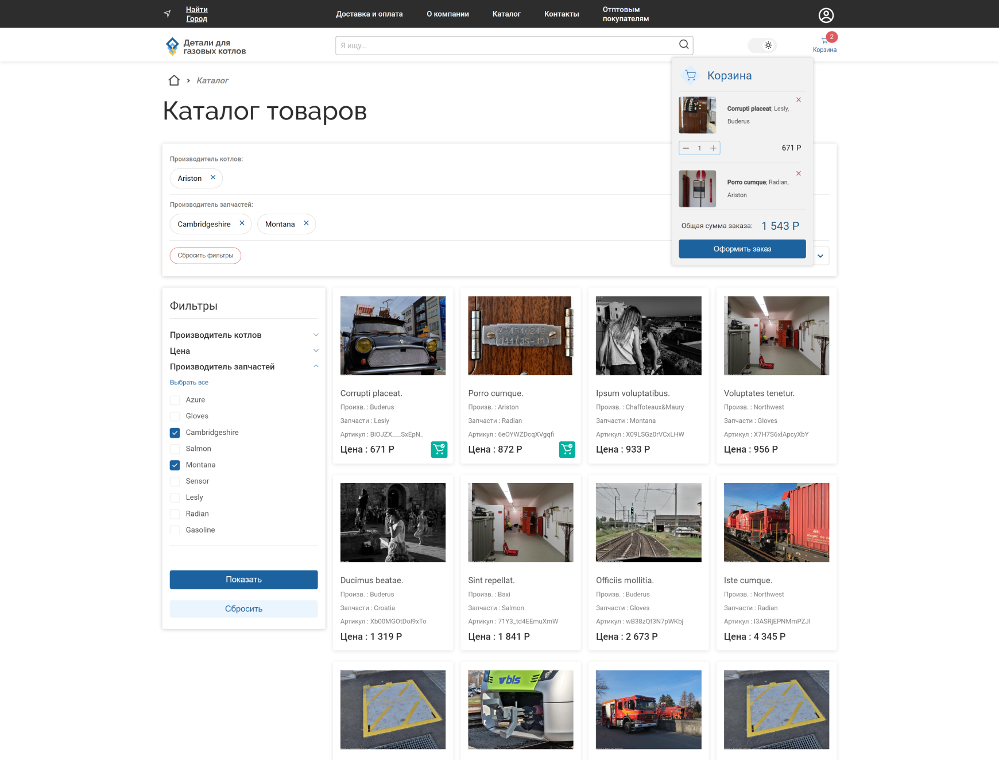

## Адаптивная верстка | интернет магазин

TypeScript

Моя работа: Fullstack с 0.

>Ссылка на гитхаб:

>Клиент https://github.com/pirogHub/onlineshop_client

>Сервер: https://github.com/pirogHub/onlineshop_server

Краткое описание:
- Реализована фильтрация и поиск товаров
- Добавление товаров в корзину
- Авторизация
- Сохранение корзины и привязка к “аккаунту”
- Оплата товаров картой с помощью сервиса Yookassa

Стек, технологии и проч:

>Сервер: NestJS, tokens

>Клиент: Онлайн оплата через Yookassa, NextJS, фильтры поиска, добавление товаров в корзину, Адаптивная верстка, Effector, Frammer motion, react-select, react-hook-form, Cookies, Session Storage

>Database: freeDb, MySQL

